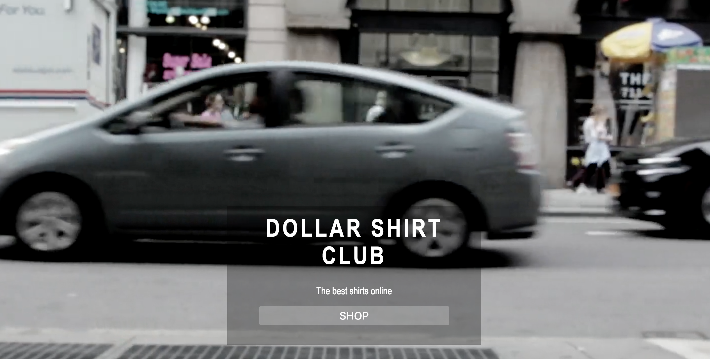

# Hi!
Very fast and scalable e-commerce site built with React.
I named it Dollar Shirt Club

### Quickstart

1. Make sure you have yarn installed...
2. `yarn install` to install dependencies
3. Run `npm start` to see the app at `localhost:3000`

#### Testing

This app includes Unit testing and test coverage with jest and enzyme 
Run `npm run test`.

## Stack
react 
react-router 
redux 
jest 
enzyme 
eslint 

#### Notes
Application is currently under construction